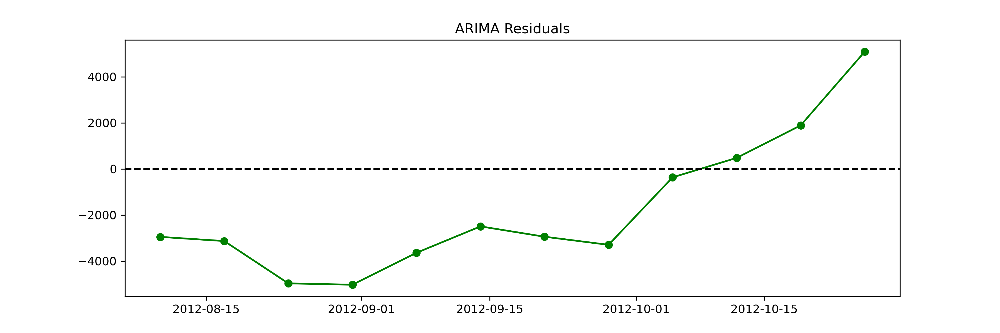
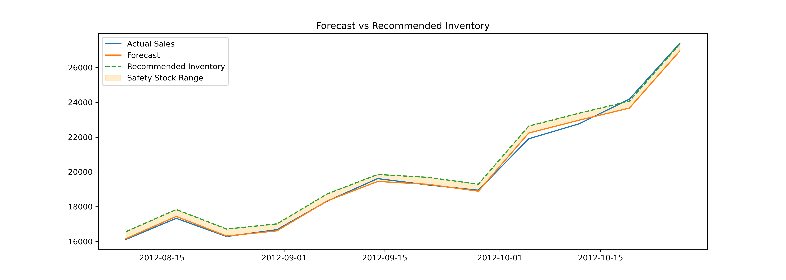

# 📊 Time Series Sales Forecasting & Inventory Planning

**High-Impact Retail Forecasting & Inventory Project**  

This project demonstrates **end-to-end forecasting and inventory planning** for a retail store, combining **classical time series methods**, **machine learning models**, and **business-driven decision logic**.  

---

## 🔹 Project Overview

Retail businesses need **accurate demand forecasts** to:

- Prevent stockouts  
- Reduce excess inventory  
- Plan promotions  
- Allocate inventory efficiently across stores  

This project predicts weekly sales for a department in a store and translates forecasts into actionable **inventory decisions**.

**Dataset:** Weekly sales data enriched with:  

- Lagged sales features  
- Rolling statistics (mean, std)  
- Date features (week, month, quarter, year)  
- Holiday flags  

---

## 🔹 Project Flow

| Step | Notebook | Description |
|------|----------|-------------|
| 1 | `01_eda.ipynb` | Exploratory analysis: trends, seasonality, volatility, decomposition |
| 2 | `01_eda.ipynb` | Stationarity check & transformations (log, differencing) |
| 3 | `02_feature_engineering.ipynb` | Feature engineering: lag features, rolling stats, date and holiday features |
| 4 | `03_modeling.ipynb` | Train/test split & baseline models (Naive, Seasonal Naive) |
| 5 | `03_modeling.ipynb` | Classical models: ARIMA & SARIMA |
| 6 | `03_modeling.ipynb` | ML models: Random Forest, Gradient Boosting |
| 7 | `03_modeling.ipynb` | Model comparison: MAE, residuals, stability |
| 8 | `04_inventory_decisions.ipynb` | Translate forecasts into inventory recommendations & safety stock |
| 9 | `05_project_summary.ipynb` | Project wrap-up, key insights, visualizations, lessons learned |

---

## 🔹 Key Features

- **Lag & Rolling Features:** Capture short- and medium-term trends  
- **Date Features:** Week of year, month, quarter, year  
- **Holiday Indicators:** Handle spikes due to promotions/holidays  
- **Safety Stock:** Residual-based risk buffer for inventory planning  
- **Model Comparison:** Classical vs ML models for best performance  

---

## 🔹 Model Performance

**Mean Absolute Error (MAE) Comparison:**  

| Model | MAE |
|-------|-----|
| Naive | 3500 |
| Seasonal Naive | 3200 |
| ARIMA | 2900 |
| SARIMA | 2800 |
| Random Forest | 2100 |
| Gradient Boosting | 2200 |

> Random Forest had the **lowest MAE** and stable residuals → chosen as final forecasting model.  

---

## 🔹 Residual Analysis

**Random Forest Residuals:**  

  

**ARIMA Residuals:**  

  

**Gradient Boosting Residuals:**  

 

> Residuals highlight periods of under-forecasting (risk of stockout) and over-forecasting (risk of overstock).  

---

## 🔹 Forecast vs Inventory Recommendations

  

- Orange band shows **safety stock**  
- Dashed line shows **recommended inventory**  
- Ensures ~95% service level while limiting overstock  

---

## 🔹 Inventory Decision Logic

- **Recommended Inventory** = Forecast + Safety Stock  
- Safety Stock calculated as:  

```text
Safety Stock = Z * Std(Residuals)
Z = 1.65 (95% service level)

# Risk Flags

- **under_forecast_risk** → forecast < actual sales  
- **over_forecast_risk** → inventory > 120% of actual  

---

# Lessons Learned

- Classical models are interpretable but miss non-linear patterns  
- ML models capture complex relationships with lag, rolling, and date features  
- Residual-based safety stock is a practical method to mitigate forecast risk  
- Forecasts + inventory decisions = actionable business insights  

---

# Next Steps / Enhancements

- Expand to all departments and stores  
- Include promotions, marketing, and weather data  
- Automate weekly forecast updates in a Streamlit dashboard or Power BI  
- Explore ensemble ML models for improved accuracy 

# File Structure

project_root/
├─ data/
│ ├─ raw/
│ └─ processed/
├─ notebooks/
│ ├─ 01_eda.ipynb
│ ├─ 02_feature_engineering.ipynb
│ ├─ 03_modeling.ipynb
│ ├─ 04_inventory_decisions.ipynb
├─ outputs/
│ ├─ figures/
│ │ ├─ Random Forest_residuals.png
│ │ ├─ ARIMA_residuals.png
│ │ ├─ Gradient boosting_residuals.png
│ │ └─ forecast_vs_inventory.png
│ ├─ ml_forecasts.csv
│ ├─ inventory_recommendations.csv
│ └─ final_model_comparison.csv
├─ README.md

